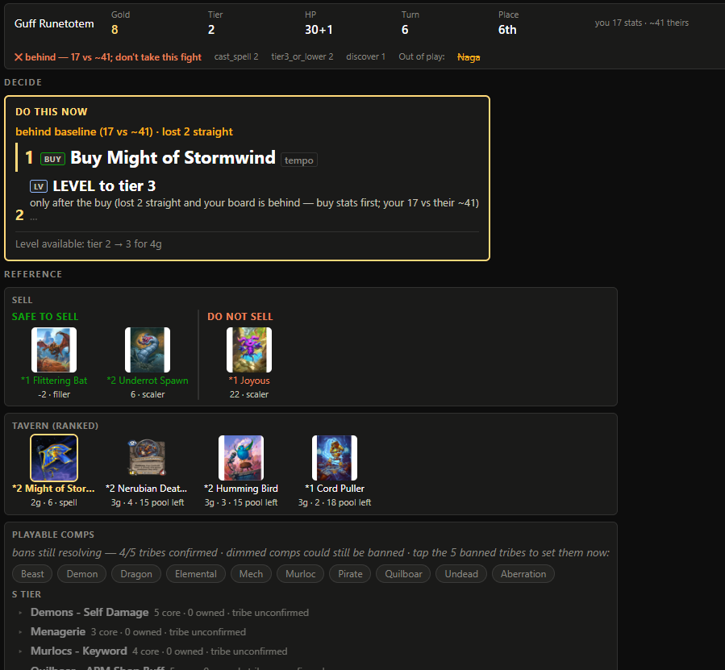
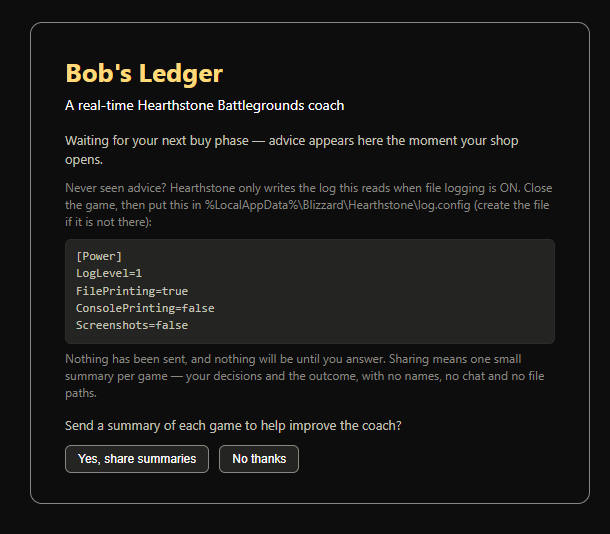

# Bob's Ledger



A real-time coach for **Hearthstone Battlegrounds**. It watches the game you are
already playing, reads the board you actually have, and tells you the best move
this turn — with the reason why.

**Windows only.** It reads the log file Hearthstone writes on your own PC and
asks for no account. It does not modify the game — the one file it can change is
Hearthstone's own logging setting, and only if you say yes to it (see
[turning on logging](#turn-on-hearthstones-logging)).

**[Install it](#install-it)** · **[Turn on logging](#turn-on-hearthstones-logging)** ·
**[The question it asks you](#the-one-question-it-asks-you)** · **[Something's wrong](#if-somethings-wrong)**

## What you need

- A Windows PC with Hearthstone installed.
- Python 3 — free. If it is missing, the app tells you and links you to it.
- Five minutes, most of it the download.

## Install it

**1. Download it.** [Click here](https://hearth-telemetry-collector.bobs-ledger.workers.dev/release/latest.zip)
— it saves as `Bob's Ledger.zip`. No account needed.

**2. Unzip it.** Right-click the file → **Extract All**, somewhere you can write
to: Desktop or Documents are ideal. (Not `C:\Program Files` — Windows will not
let the coach keep its card pictures there.) You get a folder called
`Bob's Ledger`.

**3. Double-click `Start Bob's Ledger.cmd`** in that folder. That is the whole
install. It finds Python, asks before adding the one small extra it needs, tells
you where Hearthstone's log folder should be, offers a **shortcut with its own
icon** for the folder and your Desktop, then opens the overlay in your browser.

Windows may ask once whether to run a file from an "unknown publisher" — the
normal prompt for anything you downloaded. Click **Run**.

Already unzipped it? Skip to [logging](#turn-on-hearthstones-logging).

## Turn on Hearthstone's logging

**The app offers to do this for you.** If logging is off when you start it, it
asks — say yes and the step is done: it adds the two lines the coach needs to the
settings file Hearthstone already has, leaves the rest of that file exactly as it
was, and keeps a copy of the original first. (It will not do it while Hearthstone
is running, because the game only reads that file when it starts.)

To do it by hand instead: by default Hearthstone does not write the file the
coach reads.

1. Close Hearthstone.
2. Hold **Win**, press **R**, paste `%LocalAppData%\Blizzard\Hearthstone`, press
   Enter.
3. Open `log.config` with Notepad — or create it there — and make sure it
   contains at least this:

   ```
   [Power]
   LogLevel=1
   FilePrinting=true
   ConsolePrinting=false
   Screenshots=false
   ```

4. Start Hearthstone.

If you use Hearthstone Deck Tracker or Firestone, this file exists already and
you are done.

## What you'll see

The overlay opens as a page in your browser and updates as you play — not a
second game window, so put it on another monitor or leave it behind the game.

- **Left — the decision.** The one move for this turn, in large text, with the
  reason underneath and the numbers behind it.
- **Right — the reference.** Your shop ranked for the board you have, the comps
  worth committing to and how close you are to each, and what your next opponent
  is likely bringing.

It ranks the awkward picks too: heroes, trinkets, discovers.

## The one question it asks you



The first time it starts, the coach asks whether it may send a short summary of
each finished game back to me. **Nothing is sent unless you say yes**, and saying
no changes nothing else about the coach.

If you say yes, a summary is your decisions and how the game went: turn, gold,
tavern tier, health, what was advised, and what happened next. Not your name, not
the chat, not your file paths, and not your log file. A copy of everything sent
is kept in `session_reports/` in the app folder, so you can read it yourself. To
change your mind, press **Clear** at the top-right of the overlay to bring the
question back.

Why I ask: the advice has not been measured against results yet, and those
summaries are how it gets measured.

## One honest thing about the advice

Bob's Ledger is a second opinion, not an oracle. Its recommendations have not yet
been checked against outcomes, and its own audits say some of them — the ones
about when to level up especially — may be wrong. Treat a surprising call as a
question worth pricing, not a verdict.

## Two more things worth knowing

- **Patch days.** After a Hearthstone patch the coach's reference data lags a few
  days, so advice can be less sharp until it catches up. It looks for a new
  version every time you start.
- **Where it comes from.** The advice is worked out on your own PC, from
  Hearthstone's log plus a reference file that ships with the app — nothing is
  sent anywhere to produce it, and it works with your internet off. Only the card
  pictures need a connection.

## If something's wrong

- **A black window flashes and vanishes.** You ran the file from inside the .zip.
  Unzip it first (step 2), then run it from the folder you get.
- **It says Python was not found.** Install Python from python.org, tick **Add
  python.exe to PATH**, and run the file again.
- **The overlay keeps waiting for advice.** Hearthstone's logging is probably
  still off. The overlay shows that same setting on screen.
- **The advice stops changing.** The overlay says how long ago it was written, so
  you can tell stale advice from live advice.
- **It says the folder cannot be written to.** Move the `Bob's Ledger` folder to
  Documents or the Desktop and start it again.

Still stuck? [Open an issue](https://github.com/mharrell/bobs-ledger/issues) with
what the window said, or a screenshot of it.

## Uninstalling

Delete the `Bob's Ledger` folder, and the shortcut if you made one. Nothing else
was installed — no registry entries, no services, nothing left behind.

## Licence & credits

MIT licensed — see `LICENSE`. Card names, card text and card art are © Blizzard
Entertainment, and this is an unofficial fan tool: not affiliated with, or
endorsed by, Blizzard. Card data comes from
[HearthstoneJSON](https://hearthstonejson.com), and the sources behind the comp
reference are credited inside `meta/comps.json`.

## Working on the code

*(Section two of this rewrite — for anyone cloning the repository — is not written
yet. This branch exists so the first section can be read as it will render.)*
