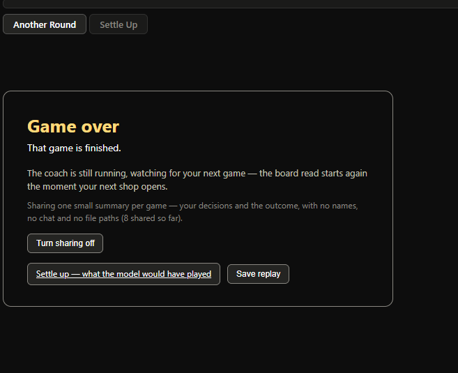
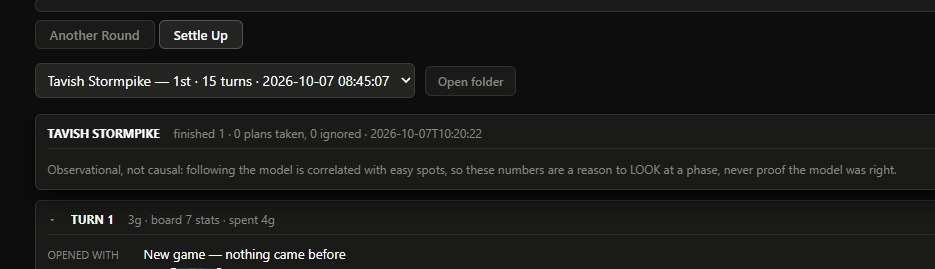
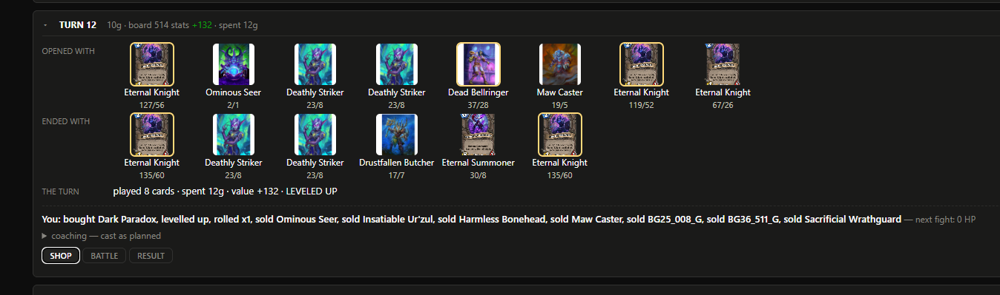
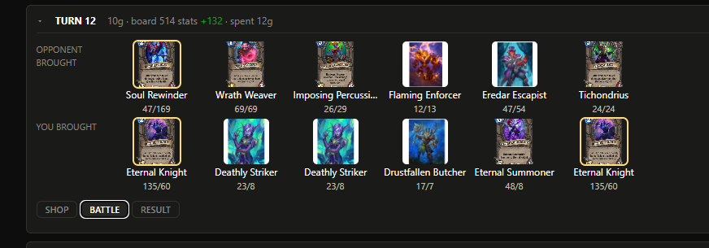
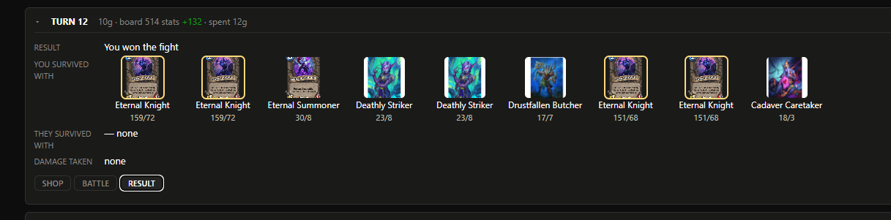

# Bob's Ledger

A tracker for **Hearthstone Battlegrounds** that reads the game's own log file
and shows you the board you actually have: what each of your minions is worth,
which pieces of a comp you hold and which you are missing, how hard the lobby is
pressing, what each tavern offer costs, and how close this hero is to dying.

**It shows you the state, not the instruction.** It does not tell you what to
buy, and that is a deliberate limit rather than a missing feature — see
[Is this allowed?](#is-this-allowed) for the reasoning. While you play, the
model's opinion appears as a number you read, never as a move it names. Its plan
for each turn is still worked out and written to your own disk, and you see it
**after the game**, in [Settle Up](#settle-up-the-review) — where the decision it
describes can no longer be acted on.

**Windows only.** It reads the log file Hearthstone writes on your own PC and
asks for no account. It does not modify the game — the one file it can change is
Hearthstone's own logging setting, and only if you say yes to it (see
[turning on logging](#turn-on-hearthstones-logging)).

**[Install it](#install-it)** · **[Turn on logging](#turn-on-hearthstones-logging)** ·
**[Is this allowed?](#is-this-allowed)** · **[The question it asks you](#the-one-question-it-asks-you)** ·
**[Something's wrong](#if-somethings-wrong)**

## What you need

- A Windows PC with Hearthstone installed — on any drive.
- Python 3 — free. If it is missing, the app tells you and links you to it.
- Five minutes, most of it the download.

## Install it

**1. Download it.** [Click here](https://hearth-telemetry-collector.bobs-ledger.workers.dev/release/latest.zip)
— it saves as `Bob's Ledger.zip`. No account needed.

**2. Unzip it.** Right-click the file → **Extract All**, somewhere you can write
to: Desktop or Documents are ideal. (Not `C:\Program Files` — Windows will not
let the coach keep its card pictures there.) You get a folder called
`Bob's Ledger`.

**3. Double-click `Start Bob's Ledger.cmd`** in that folder. That is the whole
install. It finds Python, asks before adding the one small extra it needs, tells
you where it will read Hearthstone's log from, offers a **shortcut with its own
icon** for the folder and your Desktop, then opens the overlay in your browser.

Windows may ask once whether to run a file from an "unknown publisher" — the
normal prompt for anything you downloaded. Click **Run**.

Already unzipped it? Skip to [logging](#turn-on-hearthstones-logging).

## Turn on Hearthstone's logging

**The app offers to do this for you.** If logging is off when you start it, it
asks — say yes and the step is done: it adds the two lines the coach needs to the
settings file Hearthstone already has, leaves the rest of that file exactly as it
was, and keeps a copy of the original first. (It will not do it while Hearthstone
is running, because the game only reads that file when it starts.)

To do it by hand instead: by default Hearthstone does not write the file the
coach reads.

1. Close Hearthstone.
2. Hold **Win**, press **R**, paste `%LocalAppData%\Blizzard\Hearthstone`, press
   Enter.
3. Open `log.config` with Notepad — or create it there — and make sure it
   contains at least this:

   ```
   [Power]
   LogLevel=1
   FilePrinting=true
   ConsolePrinting=false
   Screenshots=false
   ```

4. Start Hearthstone.

If you use Hearthstone Deck Tracker or Firestone, this file exists already and
you are done.

## The two tabs

The page you get has **two tabs at the top**, and they answer the two different
questions a Battlegrounds game leaves you with:

- **Another Round** — the live view, and where you start. Everything the coach
  knows while you are playing is on this tab: your board and what it is worth,
  the next opponent, the lobby, the shop. You read it and decide; it never names
  a move. The next section describes it, and the screenshots in `docs/` do not
  cover it yet — it is the one screen still waiting for a picture.
- **Settle Up** — the review, and it is about games that are **over**. Pick a
  saved game from the dropdown and read it turn by turn: the board you brought,
  the one your opponent brought, who won, and — folded away — the plan the model
  would have played, beside what you actually did. Where a turn's fights ran
  together and the winner cannot be read, it says so rather than picking one. It
  is empty until you save a game, which is what **Save replay** on the
  end-of-game card is for. [Its own section is below.](#settle-up-the-review)

The tab you are on is remembered across a page reload, and switching between them
never interrupts the live view: the page keeps reading the game on both tabs, so
leaving Another Round to look at an old game costs you nothing.

## What you'll see

The overlay opens as a page in your browser and updates as you play — not a
second game window, so put it on another monitor or leave it behind the game.
The page's bottom-right corner names the release it was served by
(`release: …`), in the same quiet gray as the tab row's sharing control, so a
screenshot can say which version it came from.

- **Left — where the game stands.** How strong your board is against the next
  opponent and against the lobby, how close this hero is to dying and to what,
  what is in your hand, and how charged a hand-engine is.
- **Right — the reference.** Your board with each minion's value and its role,
  the comp this board reads as closest to and which of its pieces you hold, how
  close each candidate comp is to its commit threshold, who in the lobby is
  contesting which tribe, and the tavern's offers with their prices and pool
  counts — in the order the game shows them, not ranked.

Every card carries the same facts: its tier, its text on hover, and what it is
worth. Nothing on the page names a move.

**When the game asks you to choose, the panel shows what is known about each
option** — a hero pick, a trinket pick, a Discover — in the order the game
offered them, and never in an order that means "take this one":

- **A hero** — its power, spelled out, and how often the population picks it.
- **A trinket** — how often it is picked, its average placement, and how often
  it finishes top 4, which is the part an average hides: a consistent 4th and a
  coin-flip between 1st and 8th average the same and are not the same trinket.
  Under that, what the trinket actually does for the board and comp you have.
- **A Discovered card** — whether it is a piece of the comp you are on and how
  much of that comp you already hold ("core of Beasts - Tasty Lobstah, you have
  1 of its 2"), or the fact that it is not one.

Population numbers come from the curated meta DB — population statistics scraped
from hsreplay.net, bundled with the app, and read offline. Nothing there is a
recommendation, and no option is highlighted as the one to take.

**Two ways to read the live game: Classic and Tavern.** A **Classic | Tavern**
switch sits at the top of the Another Round page, and **Classic** is what is
described above — the default, and the only thing you see until you change it. **Tavern** is the same
information in the tavern's own dark palette, laid out as a screen per job: a
status bar naming the hero with gold, tier, health, turn and place; one row of
lobby tribes you can tap to correct; and a **Shop | Comps | Lobby** tab row with
the **Facts** table always beside it.

- **Shop** — the tavern's offers, your board and your hand as rows of cards with
  a one-line caption under each, and a rail of the **Facts**: effective health,
  what the last fight cost, what the last three cost, the per-combat damage cap,
  your board's stats against the last board seen, and what levelling up costs.
  Those are the same facts the classic layout carries, stated as numbers instead
  of as a read on the game — nothing on the Tavern screen tells you what to do.
- **Comps** — the comps this lobby allows, grouped under a sticky header per
  source tier (one column, or two once the window is wide enough for both), each
  with its core cards as small slots showing the cards themselves, dimmed when you
  do not own them, then how much of the core you hold and the average placement
  your own played games have produced for it — marked **low sample** when that
  count is small, and left out altogether while no comp in that tier has been
  played. Sort by tier, overlap or average placement, open a comp for its core and
  flex cards and its written guide, and tick up to three to compare them side by
  side. Comps whose tribe is not in play this patch are hidden, and the count of
  them is shown.
- **Lobby** — who among the seats you have seen is contesting which tribe, and the
  last board the next opponent staged, with their trinkets.

When the game asks you to choose, the Tavern pick screen gives each option its
headline figure, the placement distribution as eight bars, and controls for which
rows you see and in what order they are listed — starting with the order the game
offered them. The end-of-game card is centred, with the placement and round large,
an **Open in Settle Up** button, and the save-every-replay answer on one line.

Which viewer you use is remembered for next time.

## Upcoming features

Not a promise list with dates — it is the order this project is working in, and
anything on it can change or be dropped.

- **Your own record, beside the population's.** The pick panel shows how the
  population plays a hero or trinket; next is your own history next to it ("you
  have played this hero 4 times, average place 3.2"). That data is already on
  your machine, in your own decision logs — this is a reason to read it, not a
  reason to send it anywhere.
- **Hand a game back.** A consented way to send a saved replay in, so the advice
  can be measured against real games instead of the maintainer's own. It would
  show you exactly what it carries before anything leaves the machine, and it
  would be off unless you turn it on — the same rule as the session summary
  above.
- **One replay pass instead of two.** Building a review currently replays the
  game twice, about ten seconds for a fifteen-turn game. One pass would halve
  the wait when you save.
- **A fight result on every turn.** When a fight straddles the turn boundary the
  review cannot always name a winner; it says so rather than guessing, and
  fixing that is worth doing.
- **A picture of the live page.** The screenshots in `docs/` show the review.
  The live overlay is the one surface with no shot of it yet.

## Settle Up (the review)

When a game ends, the card on screen offers **Save replay**. Saving keeps
that game in the overlay's **Settle Up** tab (the second tab at the top of
the page, next to **Another Round**): pick any saved game from the dropdown
and the turn-by-turn view opens with real card tiles. The card also carries
a **Save every replay automatically** checkbox — leave it ticked and each
finished game is kept as its review builds, no click per game. Saving is per
game and yours alone — nothing saved leaves your machine, and it never ships
in a release. For games you didn't save, `settle_up.py` still reviews
anything still in the log:

    python app\settle_up.py --latest --html my-review.html




**The part the game never shows you: the board, three times a turn.** For every
turn the review shows what you brought into the fight, what your opponent
brought, and what survived — plus what the turn cost.

    t5  7g  board 15 stats (+12)  spent 7g
       you brought     : Locked-up Mutineer 6/3, Crackling Cyclone 2/1,
                         Crackling Cyclone 2/1, Wolf Pup 3/6, Fire Baller 4/3
       they brought    : Dune Dweller 3/3, Fetid Corroder 3/3
       survived        : Wolf Pup 3/6, Locked-up Mutineer 6/3, Fire Baller 4/3,
                         Crackling Cyclone 2/1, Crackling Cyclone 2/1

The numbers on that line are the turn's own: gold at the end of the buy phase,
your board's total attack + health and how much it changed, and what you spent
on cards, rolls and levelling. A turn marked **?** is one worth a second look —
you sold a key card while a filler stayed on the board. It is a question, not a
verdict, and a turn where you sold most of your board is labelled a rebuild
instead, because that is what it is. Keep an eye out for `*` after a minion's
stats: that one is golden.

Each turn card opens on **Shop** — the board you opened with and the board you
closed the shopping on, plus what the turn did (cards played, gold spent, board
value gained, a level-up, a hero power, a trinket), and the model's line for that
phase. **Battle** is your board and your opponent's, theirs on top, the way the
game shows a fight. **Result** says who won — or says that the turn's fights ran
together and the winner cannot be read, which is honest rather than a guess —
what each side kept, and what the fight cost you in effective HP.

A fight's summoned copies linger in the log past the end of the fight, so the
board you opened with is shown without them: a board holds seven minions and no
two can share a slot, and those are the rules the review uses to tell a leftover
from a minion that is really there. A turn where that happened says so in a line
under the board. The alternative was a nine-minion board you never had.





**Then the phase-by-phase view, inside each turn's Shop view**, which is where
the plan lives — your own line first, the model's folded behind it:

- **You** — what the log says you did: bought, rolled, levelled up, sold. What
  the fight after it cost you in effective HP sits on the same line; negative
  means it hurt.
- **coaching** (click to open) — the plan it would have played, e.g. "1. LEVEL
  to tier 4 · 2. Buy Bronze Warden", headed by what it made of your line:
  taken, not taken, or not graded.

It also says how much of itself it *could not* judge. A plan that opens with a
minion swap, or with a spell whose card it could not resolve, is reported as
**not graded** rather than counted either way, and the count is printed on the
summary — it will not pretend to have assessed a decision it cannot see.

The summary prints how the phases you followed went against the phases you
didn't — and says plainly that this is **observational, not causal**, because
following a plan is easier in games you were already winning. It also warns you
when the count leans on turns that opened with a spell, because a turn that
casts several spells can satisfy "cast the one it named" by accident. Read any
of it as a reason to look at a turn, never as a score.

The review also exists as a standalone page — the command above writes one
with `--html`, and `/review` on the running coach serves the game that just
ended.

**Two ways to read a saved game: Classic and Tavern.** The header of the Settle
Up tab carries a **Classic | Tavern** switch. **Classic** is what is described
above, and it stays the default. **Tavern** reads the same game one turn at a
time: a strip of turn buttons along the top, each marked with the result and the
HP the fight cost, the turn itself large in the middle, and a rail down the side
summarising what the turn cost and did — buys, sells, rolls and casts, with
repeats collapsed and a count of each. A card you bought and sold back in the
same phase never appears on either board, so it is shown as *passed through*
instead of vanishing, and the turn's net effect on your board is marked on the
minions themselves. Its **Battle** tab is the two boards facing each other the
way the game shows a fight.

Tavern also carries a **Summary | Step through** switch. Step through replays
the turn one action at a time — a tick per action, lettered by kind and coloured
by it, with the board as it stood after that action, and the card you sold shown
dimmed and tagged rather than simply missing. Left and Right walk turns, or
steps while stepping; Shift with them walks turns while stepping; Space plays and
pauses; Home and End jump to the ends. Both choices — viewer and mode — are
remembered for next time.

Step through needs a replay saved with its per-action boards, which arrived with
this version: an older saved game opens it disabled and says so. **Rebuild** in
the Settle Up header re-derives any saved game from its own log, which is also
how an older save gets the per-action boards.

**A whole session, or your last few.** `--session` reviews every game in the
newest log and puts them in one table — placements, boards, spend, and how often
you took the plan. `--history 3` does the same across your three newest logs.
Both re-read every game in full, so they take a few seconds per game; the
single-game review is instant by comparison.

    python app\settle_up.py --latest --session
    python app\settle_up.py --history 3

## The one question it asks you

The first time it starts, the coach asks whether it may send a short summary of
each finished game back to me. **Nothing is sent unless you say yes**, and saying
no changes nothing else about the coach.

Saying yes covers the games you play **from that point on**. Anything you played
before you answered — while the answer was no, or before there was one — was
played under "nothing leaves your machine", and it is never sent, not even after
you say yes.

If you say yes, a summary is your decisions and how the game went: turn, gold,
tavern tier, health, what was advised, what happened next, **where you finished**
and what each fight cost you in effective HP. Not your name, not
the chat, not your file paths, and not your log file. A copy of everything sent
is kept in `session_reports/` in the app folder, so you can read it yourself.

To change your mind, use the sharing control at the **top right of the page** — a
small greyed-out line beside the tabs. It is there for as long as sharing is on,
including in the middle of a game, and it flips either way. The question itself is
only asked once, when you have not answered yet. (It used to be reachable only on
the end-of-game card, and this paragraph used to point at a **Clear** button that
no longer exists — corrected 2026-10-07.)

Why I ask: the model's plan has not been measured against results yet, and those
summaries are how it gets measured.

## One honest thing about the model

Bob's Ledger's value function is a second opinion, not an oracle. Its judgements
have not been checked against outcomes, and its own audits say some of them — the
ones about when to level up especially — may be wrong. On the live page you read
them as numbers and decide for yourself; in the review they will be shown
alongside what actually happened, which is the only honest way to present them.

## Is this allowed?

Worth answering straight, because it is the first thing a lot of people ask.

**The live overlay shows state, not instructions, and that is a deliberate
limit.** It reads the board you actually have and tells you what is true about
it: your stats against theirs, what your minions are worth, which comp pieces you
hold, what each offer costs. It does not name a move. That line was drawn
deliberately, and what it does and does not buy is worth being precise about.

Some facts, kept apart from that judgement:

- **Blizzard's rules do cover this, so read the next line rather than a
  comfortable one.** The EULA does not name "real-time assistance" anywhere, but
  it does prohibit software that "facilitates the gameplay" and grants "an
  advantage over other players not using such methods". **A statistics overlay
  grants that advantage too** — the clause does not mention verdicts, so
  "showing you numbers" is not a safe harbour, and I am not going to pretend it
  is. What the wording plainly does not describe is a bot or a hack: this does
  not touch the game's process or its memory, does not automate input, and reads
  the log file Hearthstone writes to your own disk. The one file it will change
  is Hearthstone's own logging setting, and only if you say yes. The wording
  above is quoted from
  [Section 1.C of Blizzard's EULA](https://www.blizzard.com/en-us/legal/fba4d00f-c7e4-4883-b8b9-1b4500a402ea/blizzard-end-user-license-agreement)
  — read it yourself rather than taking my summary of it.
- **So what the limit actually buys is a smaller, easier-to-defend surface — not
  permission.** Nothing in Blizzard's rules "expressly authorizes" a log-reading
  overlay; Deck Tracker, Firestone and stat overlays have instead been used
  openly for years without enforcement, which is a real reason to think this is
  fine and not a promise that it is. Blizzard reserves the right to read its own
  words differently whenever it likes. I am not a lawyer and this is not legal
  advice.
- **Two things are true at once, and the review is the honest half.** Not naming
  a move while you play is the limit this tool accepted. But the model's plan
  was never the problem by itself — an unmeasured plan asserted at you mid-turn
  was. Settle Up shows it after the game, beside what actually happened and how
  much of it the review could judge, which is the version of this that can be
  checked rather than believed.
- **None of that makes it appropriate everywhere.** Turn it off for tournaments
  and any organised event. Their rules bar outside help outright, and in that
  setting the question is not even close.
- **Keep it off stream if that worries you.** In practice this kind of thing gets
  noticed because it was on screen in a screenshot or a clip, not because
  anything detected it.
- **You are allowed to disagree with the paragraph above.** Some people draw this
  line where raw data ends and reasonable people land on both sides of it. It is
  a fair position, and the answer is to not run the coach — not to find a
  cleverer reason it is fine.

## Two more things worth knowing

- **Patch days.** After a Hearthstone patch the coach's reference data lags a few
  days, so its numbers can be less sharp until it catches up. It looks for a new
  version every time you start.
- **Where it comes from.** Every number on the page is worked out on your own PC,
  from Hearthstone's log plus a reference file that ships with the app — nothing
  is sent anywhere to produce it, and it works with your internet off. Only the
  card pictures need a connection.

## If something's wrong

- **A black window flashes and vanishes.** You ran the file from inside the .zip.
  Unzip it first (step 2), then run it from the folder you get.
- **It says Python was not found.** Install Python from python.org, tick **Add
  python.exe to PATH**, and run the file again.
- **The overlay keeps waiting.** Two things cause that, and the overlay says which
  one you have. Either Hearthstone's file logging is still off — the overlay shows
  that same setting on screen — or the coach is looking in the wrong place,
  because your game is installed somewhere other than the usual folder. The
  window you started it from prints the one-line command that fixes the second
  one for good.
- **The page stops changing.** The overlay says how long ago the last read was
  written, so you can tell a stale read from a live one.
- **It says the page needs its access key.** The overlay listens only on your own
  machine, and the address the launcher opens carries a key minted fresh for that
  run — so a plain `http://127.0.0.1:8747/` you bookmarked yourself is refused
  until the launcher has opened the overlay once. From then on that browser
  remembers the key and the plain address works. Restarting the coach mints a new
  one, so a bookmark made yesterday says so rather than showing you old advice;
  opening it from the launcher once fixes that too.
- **It says the folder cannot be written to.** Move the `Bob's Ledger` folder to
  Documents or the Desktop and start it again.

Still stuck? [Open an issue](https://github.com/mharrell/bobs-ledger/issues) with
what the window said, or a screenshot of it.

## Uninstalling

Delete the `Bob's Ledger` folder, and the shortcut if you made one. Nothing else
was installed — no registry entries, no services, nothing left behind.

## Licence & credits

MIT licensed — see `LICENSE`. Card names, card text and card art are © Blizzard
Entertainment, and this is an unofficial fan tool: not affiliated with, or
endorsed by, Blizzard. Card data comes from
[HearthstoneJSON](https://hearthstonejson.com), and the sources behind the comp
reference are credited inside `meta/comps.json`.

## Working on the code

**A note on the model tooling you will find in this tree.** I tried a language
model in the loop early on and decided against it, so nothing on the live path
calls one: `live.py`, `live_coach.py`, `value.py` and `coach_ui.py` do not
import it, and every number on the page comes from the local value function and
the meta database. The experiment is still here — `coach_llm.py` is the client,
`compare_models.py` races models against each other, and `patch_notes.py` and
`check_patch_notes.py` use one to turn official patch notes into the meta DB. It
stays because it is useful for maintainer work, and none of it ships in a
release.

### Clone and run it

```
git clone https://github.com/mharrell/bobs-ledger
cd bobs-ledger
python -m pip install -r app\requirements.txt
python app\live.py
```

That is the same program the launcher starts. `app\live.py` also takes a log path,
and `--poll 0.5` re-analyses a saved log, `--once` does a single pass, `--no-ui`
skips the overlay, `--version` prints what you are running. `python app\doctor.py`
is the one-shot pre-flight verdict: patch, coverage, art, newest log.

A clone never auto-updates: commit shas cannot prove which side is newer, so the
release check stands aside and you update with `git pull`.

### The layout

The program lives in `app/`. The root keeps what a player should see — this
README, `LICENSE`, the launcher and `docs/` (the pictures above) — plus what
never ships: `analysis/` (the maintainer's research notes) and `telemetry/`
(the release channel itself).

The screenshots are the layout as it is now: the Settle Up tab, one turn in each
of its three views, and the end-of-game card with **Save replay**. Anything older
than this set showed the pre-pivot overlay, which no longer exists.

### Tests

```
python -m unittest discover -s app/tests
```

About 1,500 tests, ~60 seconds. Some skip by design: the ones that need a
real `Power.log` or maintainer-only files report as skipped rather than passing
quietly.

Two of them are posture controls rather than behaviour tests, and they are the
reason the paragraph at the top of this file can be trusted: one asserts this
README's claims about what the coach does to your machine *and* that the
corresponding capability (process or memory access, synthetic input) is absent
from `app/`; the other asserts that the live payload carries no verdict — no
plan, no named buy, no pick — while the analysis keeps every one of them for the
decision log and the review.

### What not to break

- **The privacy gates, and the sharing whitelist.** `session_report.py`'s `SPEC`
  names every field a shared summary may contain; a field it does not name cannot
  appear, so adding one means adding it there deliberately.
- **The launcher.** `Start Bob's Ledger.cmd` has to stay CRLF and pure ASCII: a
  bare LF makes cmd.exe mis-parse it, and a stray UTF-8 byte renders as garbage in
  a console.
- **The macOS launcher's mirror of those rules.** `Start Bob's Ledger.command`
  has to be LF-only (one CR and bash dies on `$'\r'`), pure ASCII, and free of
  bash-4 syntax: `/bin/bash` is still 3.2 on macOS. **It has never been run** —
  no Mac has executed it and no shell here has even parsed it, so its first real
  run is the test.
- **The platform layer.** The client root, the `log.config` location and the
  "is Hearthstone running?" probe all branch on the platform in `config.py` and
  `setup_logging.py`, and the log lookup asks for both known `Power.log` shapes
  because which one macOS writes is still unverified.
- **The update join.** `VERSION` and `.update_state.json` are stamped into every
  release and are what let an installed copy learn that a newer one exists.
- **The install promise.** Outside Hearthstone's own `log.config` — which the
  launcher edits only when asked, keeping a backup — everything the coach writes
  stays inside its own folder. Uninstalling is deleting one folder, and that has
  to stay true.

### Releasing

```
python app\publish_release.py --note "what changed" --dry-run   # gates only
python app\publish_release.py --note "what changed"             # publish
```

It walks the working tree, runs two gates, stamps the version, uploads to the
collector's KV store and cuts a GitHub release. The gates are the review that
matters most:

- **PRIVACY** — no BattleTags, opponent handles, account ids, local paths or
  session names in any shipped text file.
- **REPRODUCIBILITY** — the zip matches HEAD, with no stray entries.

The version is the commit sha, and `VERSION` is half of the update join: without
it, an installed copy could never be offered a newer release.

### Where the detail lives

- `DESIGN.md` — architecture, and the reasoning behind it.
- `ROADMAP.md` — phase status.
- `analysis/` — the research the design came out of (not shipped).
- `telemetry/README.md` — the collector: its routes, retention and deploy notes.
